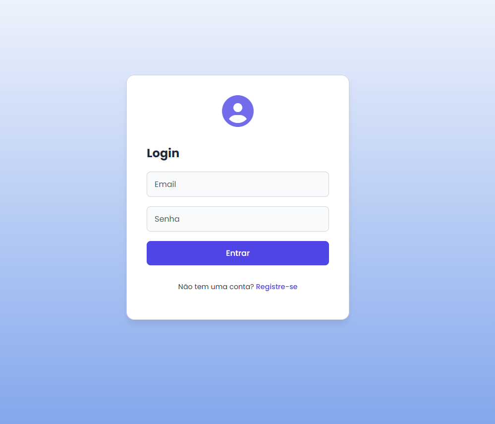
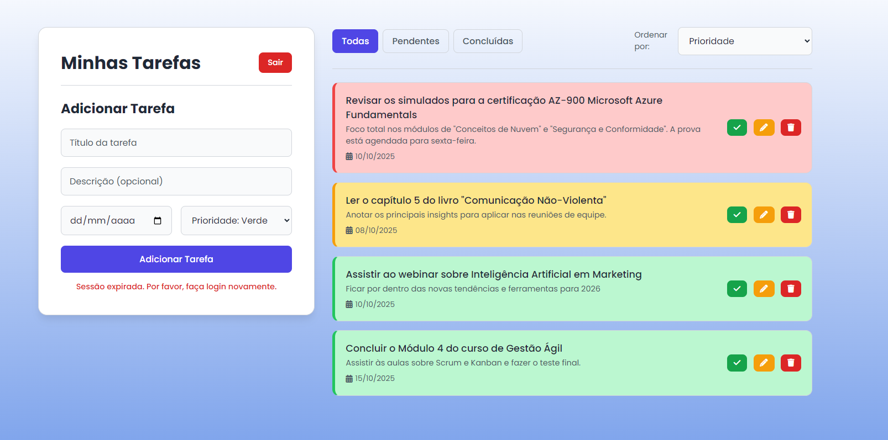

# 📋 Gerenciador de Tarefas – Full Stack


Uma aplicação completa para gerenciar suas tarefas diárias, com cadastro de usuários, login seguro e organização de atividades. Feita com FastAPI no backend e HTML/CSS/JavaScript no frontend.

## 🌐 Veja o projeto funcionando

Acesse a aplicação no ar: **[https://app-production-8a2c.up.railway.app/](https://app-production-8a2c.up.railway.app/)**





## 🎯 O que esse projeto faz?

Este é um gerenciador de tarefas onde você pode criar uma conta, fazer login e gerenciar suas atividades do dia a dia. Cada usuário tem suas próprias tarefas e ninguém mais pode ver ou modificar elas.

### 🚀 Funcionalidades principais

- **Backend**: FastAPI, autenticação JWT, ORM SQLAlchemy (async)
- **Frontend**: HTML/CSS/JS (vanilla) responsivo, UX simples e direto
- **Segurança**: hash de senha (Passlib), tokens JWT, escopo por usuário
- **Qualidade**: testes com Pytest, tipagem Pydantic, validações
- **DevOps**: Docker, Docker Compose e deploy em Railway


## 🛠️ Tecnologias utilizadas

**Backend:** FastAPI (Python), SQLAlchemy, JWT para autenticação

**Frontend:** HTML5, CSS3, JavaScript vanilla

**Banco de dados:** SQLite (desenvolvimento) e PostgreSQL (produção)

**Infraestrutura:** Docker, Docker Compose, Railway

## ⚡ Como rodar o projeto na sua máquina

### Pré-requisitos

Você precisa ter instalado:

- Docker e Docker Compose
- Git


### Passo a passo

**1. Clone o repositório**

```bash
git clone https://github.com/notdougz/first-api.git
cd first-api
```

**2. Configure as variáveis de ambiente**

Crie um arquivo `.env` na raiz do projeto (copie o `.env.example` se existir) e adicione:

```
SECRET_KEY=sua_chave_secreta_aqui
ENVIRONMENT=development
```

**3. Suba a aplicação com Docker Compose**

```bash
docker-compose up --build
```

Este comando vai construir as imagens e iniciar todos os serviços automaticamente.

**4. Acesse a aplicação**

Depois que tudo subir, você pode acessar:

- 🌐 **Frontend:** http://localhost:8080
- 🔧 **API:** http://localhost:8000
- 📚 **Documentação da API:** http://localhost:8000/docs


## 🧪 Como rodar os testes automatizados

Os testes garantem que o código está funcionando corretamente. Para rodar os testes do projeto:

**1. Entre na pasta do backend**

```bash
cd projeto-tarefas
```

**2. Instale as dependências (se ainda não instalou)**

```bash
pip install -r requirements.txt
```

**3. Execute os testes com pytest**

```bash
pytest
```

O pytest vai procurar automaticamente por todos os arquivos de teste (que começam com `test_`) e executar eles, mostrando quais passaram e quais falharam.
**Dica:** Para ver mais detalhes durante os testes, use:

```bash
pytest -v
```


## 📦 Principais endpoints da API

Depois de rodar o projeto, você pode testar esses endpoints (use o Swagger em `/docs` para facilitar):

- `POST /usuarios/` – Criar um novo usuário
- `POST /login` – Fazer login e receber um token
- `GET /tarefas/` – Ver todas as suas tarefas
- `POST /tarefas/` – Criar uma nova tarefa
- `PUT /tarefas/{id}` – Editar uma tarefa
- `DELETE /tarefas/{id}` – Excluir uma tarefa
- `GET /health` – Verificar se a API está funcionando


## 🏗️ Estrutura do projeto

```
first-api/
├── docker-compose.yml          # Configuração para rodar localmente
├── docker-compose.prod.yml     # Configuração para produção
├── projeto-tarefas/            # Código do backend (FastAPI)
│   ├── main.py                 # Rotas principais da API
│   ├── auth.py                 # Autenticação e segurança
│   ├── crud.py                 # Operações com banco de dados
│   ├── models.py               # Modelos de dados
│   ├── schemas.py              # Validação de dados
│   └── tests/                  # Testes automatizados
└── frontend/                   # Código do frontend
    ├── index.html
    ├── app.js
    └── style.css
```


## 🔒 Segurança

O projeto usa várias camadas de segurança:

- Senhas são criptografadas (não armazenamos senha em texto puro)
- Autenticação com JWT (tokens temporários)
- CORS configurado para permitir apenas domínios autorizados
- Cada usuário só acessa suas próprias tarefas

***

## 💡 Observações importantes

- O ambiente de desenvolvimento usa SQLite (banco leve em arquivo)
- O ambiente de produção usa PostgreSQL (banco robusto)
- Para parar os containers Docker, use `Ctrl+C` e depois `docker-compose down`
- Se precisar reconstruir as imagens, use `docker-compose up --build`

***

## 👤 Autor

**Douglas** – [@notdougz](https://github.com/notdougz)

Este projeto faz parte do meu portfólio como desenvolvedor. Se gostou, deixe uma ⭐ no repositório!


